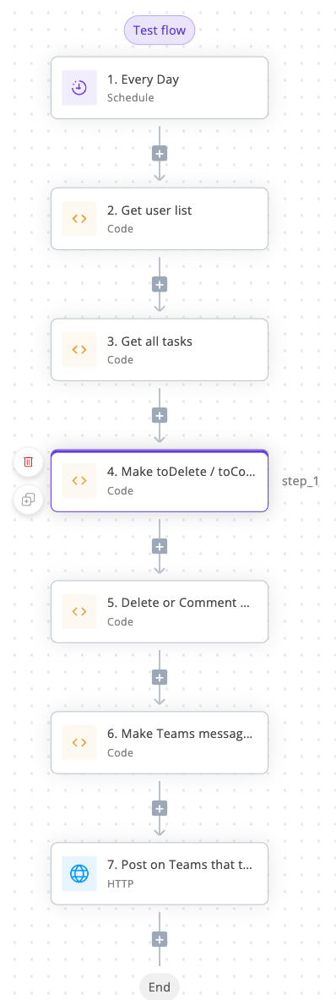

# Codes for task management bot

Dedicated task management bot for internal use on SKKUDING! \
This Bot gets User info, task info in Notion Database and inspects all tasks. \
For full use, write this codes in activepieces code snippet pieces. (1 module = 1 code snippet piece) \
 \
Example

## How to use

1. Replace NOTION_API_KEY / NOTION_DATABASE_ID in codes.
2. install npm packages(`npm install`), then do `node index.js`.
3. make use of `commentsRes` (output of comment.js)

- in our case, send `commentsRes.message` to MS Teams.
